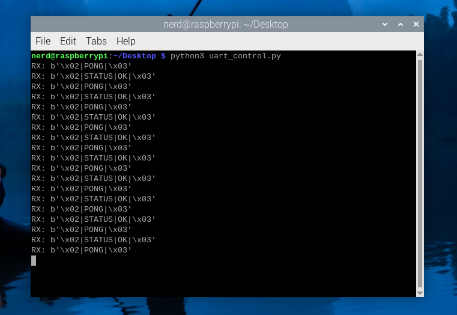

# Bidirectional UART Communication Between STM32F767 and Raspberry Pi 5


## 1. Project Overview
This project implements a robust, bidirectional UART communication interface between an STM32F767 microcontroller and a Raspberry Pi 5. It demonstrates interrupt-driven serial communication using framed command messages, suitable for professional embedded systems portfolios.


## 2. Motivation
The project showcases industry-relevant embedded communication design, focusing on reliability, non-blocking firmware architecture, and microcontroller–Linux system integration.


## 3. System [Architecture](docs/architecture.md)
The STM32F767 handles real-time UART processing using interrupts, while the Raspberry Pi 5 operates as a high-level host capable of issuing commands and receiving structured responses.


## 4. Hardware
- STM32 Nucleo-144 [STM32F767](stm32/README.md)
- Raspberry [Pi 5](raspberry-pi/README.md)
- UART [wiring](docs/wiring.md) (TX ↔ RX, RX ↔ TX, common GND)


## 5. Software Stack
- STM32CubeIDE (HAL-based firmware)
- Raspberry Pi OS (64-bit)
- Python (pySerial)


## 6. UART Protocol Design
UART messages are framed using STX (0x02) and ETX (0x03) markers:
```md
<STX>|CMD|DATA|<ETX>
```

### Commands
| Command | Description |
|------|-------------|
| PING | Health check |
| STATUS | System status |

### Responses
| Response | Meaning |
|--------|--------|
| PONG | Device alive |
| STATUS|OK | System healthy |


## 7. STM32 Firmware Design
The firmware uses HAL_UART_Receive_IT for interrupt-driven reception. Incoming bytes are buffered, parsed, and responded to without blocking the main loop.


## 8. Raspberry Pi Configuration
UART was enabled via config.txt, the serial console was disabled, and communication was validated using Python scripts on /dev/serial0.


## 9. Testing & Validation
The system was tested incrementally, culminating in full bidirectional command-response validation between the STM32 and Raspberry Pi.



## 10. Repository Structure
```
/docs      -> wiring, architecture, screenshots
/stm32        -> Core STM32 firmware code
/raspberry-pi      -> Python code
/README.md   -> Project documentation
/LICENSE     -> License file (stay intact)
```


## 11. Features (TL;DR)
- Interrupt-driven UART on STM32
- Framed command protocol
- Bidirectional messaging
- Linux-side UART handling on Raspberry Pi 5
- Reproducible setup and documentation


## 12. Future Enhancements
- CRC-based message validation
- DMA-driven UART
- Integration with larger embedded systems


## 13. Professional Relevance
This project demonstrates embedded firmware architecture, serial protocol design, and cross-platform hardware integration suitable for professional and Global Talent portfolios.
