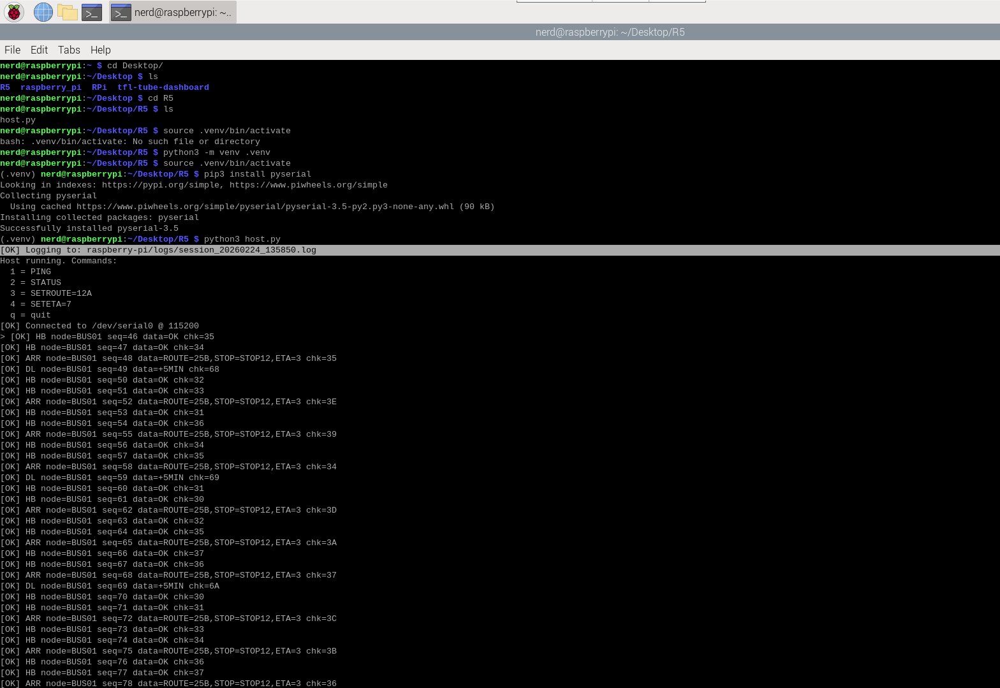

# STM32 ↔ Raspberry Pi 5 UART Transport Protocol


---

## STM32 ↔ Raspberry Pi UART Transport Protocol v0.3.0

This release introduces a structured and reliable transport layer over UART between:

- STM32F767ZI (Nucleo-144)
- Raspberry Pi 5

---

## What’s New!

### Sequence Numbers (SEQ)
- Every frame now includes a sequence number.
- Enables deterministic command-response matching.

### Host Retry Mechanism
- Raspberry Pi host retries up to 3 times if no matching response is received.
- Ensures reliable command execution.

### Duplicate Protection
- STM32 ignores duplicate commands based on SEQ.
- Prevents repeated command execution.

### Telemetry Streaming
STM32 periodically sends:
- `HB` – Heartbeat
- `ARR` – Arrival updates
- `DL` – Delay events

---


## Protocol Version

**v2 Format**

```
<STX>TYPE|NODE|SEQ|DATA|CHK<ETX>
```

Where:
```
- `STX = 0x02`
- `ETX = 0x03`
- `CHK = XOR checksum over ASCII bytes of TYPE|NODE|SEQ|DATA`
```
---

## Example Frame
```
\x02ACK|BUS01|0|PONG|56\x03
```

---

## Project Structure
```
stm32-rpi-uart-bridge/
├── docs/
├── raspberry-pi/
└── stm32/
```
---

## Hardware

- STM32F767ZI Nucleo-144
- Raspberry Pi 5 (`/dev/serial0`)
- USART3 (PB10 TX, PB11 RX)
- 115200 8N1

---

##  Running the Host (Raspberry Pi)
```bash
cd raspberry_pi
python3 -m venv .venv
source .venv/bin/activate
pip install -r requirements.txt
python3 host.py
```

```c
Interactive commands:
1 → PING
2 → STATUS
3 → SETROUTE=12A
4 → SETETA=7
q → quit
```



---

## Current Version (Status)

**v0.3.0 – Structured Transport Layer**

- SEQ implemented
- Host retries (3 attempts)
- Telemetry streaming
- Command echo replies

This version establishes a reliable, versioned transport layer and forms the foundation for:

- Backend service integration
- 16" Touchscreen dashboard UI
- Embedded LCD status module
- Deployment-ready system architecture

---

## Roadmap

See `ROADMAP.md`

Next milestone: `v0.3.1 – Reliability polish + logging`
