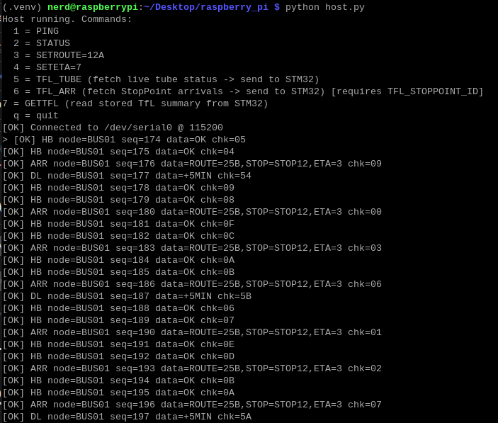
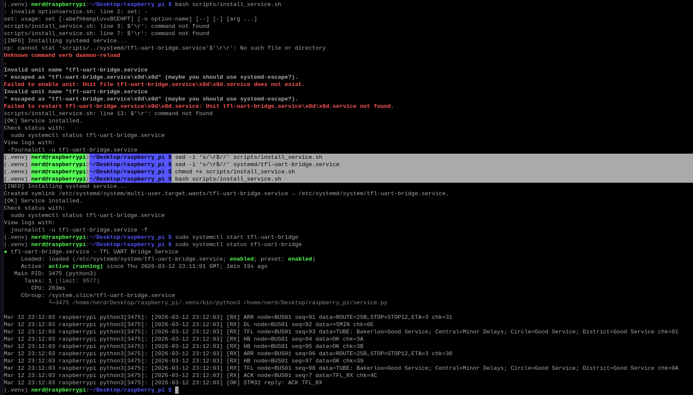
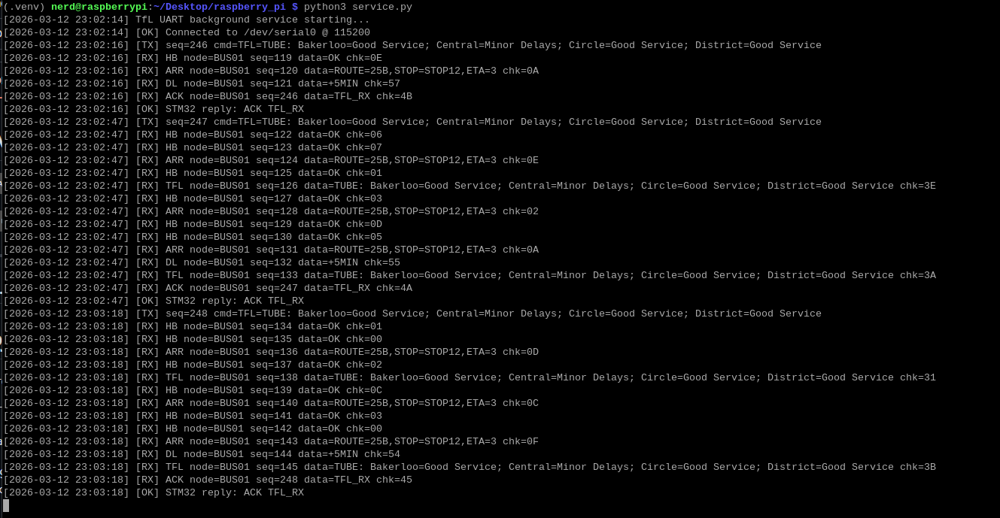

# STM32 ↔ Raspberry Pi UART Bridge for Live TfL Data


---

### Overview

This project demonstrates a hybrid embedded system architecture where a Raspberry Pi retrieves real-time public transport data from the Transport for London (TfL) Unified API, processes it, and transmits summarized updates to an STM32F767 microcontroller over a custom UART protocol.

The STM32 firmware receives, verifies, and stores the data for future use (e.g., display integration).

`The project highlights:`
- embedded communication design
- reliable UART transport protocol
- integration between Linux SBC and microcontroller firmware
- real-time API data ingestion
- service-oriented background operation on Raspberry Pi

### System Architecture
```md
              Internet
                 │
                 │
        Transport for London API
                 │
                 ▼
         Raspberry Pi 5
    (Python background service)
                 │
                 │ UART (115200)
                 ▼
            STM32F767 MCU
      (protocol parsing + storage)
                 │
                 ▼
       Future output devices
       (LCD / OLED / signage)
```
### Responsibilities:
`Raspberry Pi`
- Fetch real-time TfL data
- Summarize transport status
- Send updates to STM32
- Run as a background service

`STM32`
- Receive UART frames
- Validate checksums
- Store TfL summaries
- Respond to host commands
- Protocol Design

**The communication protocol is a lightweight framed UART transport.**

### Frame Format
```md
<STX>TYPE|NODE|SEQ|DATA|CHK<ETX>
```
Where:
```md
Field----------->Description
STX->	          Start of frame (0x02)
TYPE->	        Message type
NODE->	        Sender node identifier
SEQ->	          Sequence number
DATA->	        Payload data
CHK->	          XOR checksum
ETX->	          End of frame (0x03)
```

### Example Frame
```md
<STX>CMD|HOST|42|TFL=Bakerloo=Good Service|5F<ETX>
```
### Message Types
```md
Type--------->Meaning
CMD->	      Command from host
ACK->	      Acknowledgement
STATUS->	  System status
HB->	      Heartbeat
ARR->     	Arrival update
DL->	      Delay event
ERR->	      Error response
```

### Supported Commands
```md
Command--------------->Description
PING	               Connectivity test
STATUS	             Retrieve system status
SETROUTE=<id>	       Set simulated route
SETETA=<min>	       Set arrival ETA
TFL=<summary>	       Send TfL summary
GETTFL	             Retrieve stored TfL summary
```

### Repository Structure
```md
stm32-rpi-uart-bridge
│
├── README.md
├── LICENSE
├── .gitignore
│
├── docs
│   ├── architecture.md
│   ├── protocol.md
│   └── release-notes
│
├── raspberry-pi
│   ├── host.py
│   ├── service.py
│   ├── uart_transport.py
│   ├── tfl_client.py
│   ├── tfl_poll.py
│   │
│   ├── requirements.txt
│   ├── .env.example
│   │
│   ├── logs
│   │   └── .gitkeep
│   │
│   ├── scripts
│   │   ├── run_dev.sh
│   │   └── install_service.sh
│   │
│   └── systemd
│       └── tfl-uart-bridge.service
│
└── stm32
    └── firmware
        └── main.c
```

### Raspberry Pi Setup
- Install dependencies
```bash
sudo apt update
sudo apt install python3 python3-venv
```

- Create environment
```bash
python3 -m venv .venv
source .venv/bin/activate
pip install -r requirements.txt
```
### Environment Configuration
- Create .env
```bash
cp .env.example .env
```
Example:
```md
TFL_APP_KEY=YOUR_TFL_APP_KEY
UART_PORT=/dev/serial0
UART_BAUD=115200
POLL_INTERVAL=30
```

### Running the System
- Manual development mode
```py
python3 host.py
```

### Interactive commands:
```
1 = PING
2 = STATUS
3 = SETROUTE
4 = SETETA
5 = TFL_TUBE
6 = TFL_ARR
7 = GETTFL
```

### Background Service Mode (v0.5.0)
The Raspberry Pi can run as a continuous background service.

- Start manually:
```py
python3 service.py
```

The service will:
- fetch TfL data every 30 seconds
- summarize results
- send `TFL=` update to STM32
- retry on UART failures

### systemd Auto-Start
Install service:
```bash
bash scripts/install_service.sh
```
Check service:
```bash
sudo systemctl status tfl-uart-bridge.service
```
View logs:
```bash
journalctl -u tfl-uart-bridge.service -f
```

### STM32 Firmware
The STM32 firmware implements:
- UART RX interrupt state machine
- framed protocol parsing
- XOR checksum verification
- duplicate command detection
- reply retransmission

Key features:
- interrupt-driven UART reception
- safe RX buffer handling
- host command handling
- persistent TfL summary storage

### Example Demo:
```
Host-terminal
```

```
Systemd-status
```

```
Uart-telemetry
```


### Planned for v0.5.0
- non-blocking STM32 UART TX
- DMA/interrupt transmission
- improved buffering
